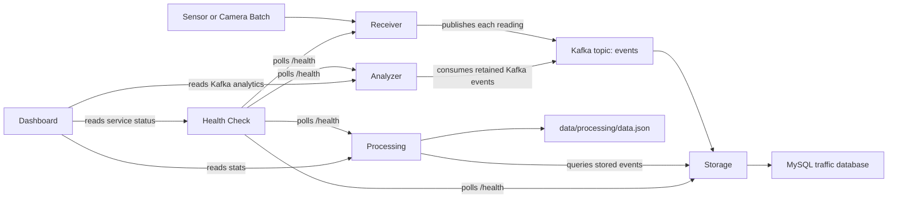

# ACIT 3855 Traffic Monitoring Microservices Lab

This repository contains a containerized traffic monitoring system built for ACIT 3855 Services-Based Architecture. The project ingests school-zone traffic events, streams them through Kafka, stores raw events in MySQL, computes aggregate statistics, monitors service health, and exposes everything through a web dashboard.

The system is designed around small services with clear responsibilities:

- `Receiver` accepts incoming event batches from sensors or cameras.
- `Storage` consumes Kafka messages and persists them to MySQL.
- `Processing` computes rolling summary statistics from stored data.
- `Analyzer` inspects the Kafka topic and serves event/topic analytics.
- `Health Check` polls service health and records system availability.
- `Dashboard` presents the current state of the system in the browser.

The assignment brief is included in `ACIT3855_Winter2026_Assignment1.pdf`.

## Project Overview

The project models a school-zone traffic monitoring platform. Devices submit two kinds of traffic data:

- Speeding violation batches
- Traffic congestion count batches

Each incoming batch is validated by the Receiver service. The Receiver then normalizes the payload and publishes individual event records to the Kafka `events` topic. Storage consumes those messages and inserts them into MySQL tables. From there:

- Processing periodically queries Storage to generate summary statistics
- Analyzer continuously reads Kafka and keeps an in-memory history of retained topic events
- Health Check periodically polls backend `/health` endpoints
- Dashboard displays Processing stats, Analyzer data, and backend health in one place

## Architecture



## Services

| Service | Port | Purpose | Main Inputs / Outputs |
| --- | --- | --- | --- |
| `receiver` | `8080` | Accepts incoming speeding and congestion batches and publishes them to Kafka | Input: HTTP POST batches, Output: Kafka messages |
| `storage` | `8090` | Consumes Kafka messages and stores events in MySQL; exposes query endpoints | Input: Kafka `events`, Output: MySQL rows and GET APIs |
| `processing` | `8100` | Computes aggregate statistics on a scheduler | Input: Storage GET APIs, Output: `data/processing/data.json`, `/processing/stats` |
| `analyzer` | `8110` | Reads Kafka topic contents and serves event lookups and topic counts | Input: Kafka `events`, Output: `/analyzer/stats` and indexed event APIs |
| `health-check` | `8120` | Polls backend health endpoints and records availability | Input: backend `/health` endpoints, Output: `data/health-check/data.json`, `/health-check/status` |
| `dashboard` | `80` | Browser UI and reverse proxy for all APIs | Input: browser requests, Output: HTML/CSS/JS dashboard |
| `kafka` | internal | Event broker for asynchronous communication | Receives events from Receiver, consumed by Storage and Analyzer |
| `zookeeper` | internal | Kafka dependency used by the current Docker setup | Supports Kafka |
| `db` | `3306` internal | MySQL database named `traffic` | Stores raw traffic event rows |

## How Each Service Works

### Receiver

Receiver exposes two POST endpoints:

- `/receiver/events/speeding`
- `/receiver/events/congestion`

Important behavior:

- Requests are validated against `Receiver/openapi.yml`
- One incoming batch can contain multiple readings
- Receiver generates one `trace_id` per batch
- Receiver publishes each reading as an individual Kafka message
- Each Kafka message uses this structure:

```json
{
  "type": "speeding",
  "payload": {
    "trace_id": "uuid",
    "sender_id": "uuid",
    "location_id": "SZ-042",
    "batch_timestamp": "2026-01-09T08:00:00Z",
    "reading_timestamp": "2026-01-09T07:43:12Z"
  }
}
```

Event types used in Kafka:

- `speeding`
- `congestion`

### Storage

Storage consumes the Kafka `events` topic and inserts records into MySQL.

MySQL tables:

- `speeding_violation`
- `congestion_count`

Important behavior:

- Kafka consumer group: `event_group`
- Offsets are committed only after a successful database write
- The service exposes query endpoints for retrieving stored events within a time range
- Query results are returned from MySQL using SQLAlchemy models

### Processing

Processing runs on a background scheduler every `7` seconds. It calls Storage to retrieve events created since the last successful run and updates aggregate statistics in `data/processing/data.json`.

Stats returned by `/processing/stats`:

- `num_speeding_events`
- `min_speed_kmh`
- `max_speed_kmh`
- `num_congestion_events`
- `max_vehicles_passing`
- `last_updated`

### Analyzer

Analyzer consumes the Kafka topic and keeps an in-memory cache of events. It is intended to inspect the topic itself rather than the MySQL database.

It exposes:

- Total topic counts via `/analyzer/stats`
- Speeding event lookup by index via `/analyzer/events/speeding?index=...`
- Congestion event lookup by index via `/analyzer/events/congestion?index=...`

Important behavior:

- Kafka consumer group: `analyzer_group`
- Consumer offset reset strategy: `earliest`
- Analyzer data is memory-backed, so restarting the service clears its cache until it re-consumes the topic

### Health Check

Health Check polls these service health endpoints:

- Receiver
- Storage
- Processing
- Analyzer

It records service availability as:

- `Up`
- `Down`
- `Unknown`

Its scheduler runs every `5` seconds and writes the latest status snapshot to `data/health-check/data.json`.

### Dashboard

Dashboard is an Nginx container serving static frontend files from `Dashboard/`. It is also the public gateway to the backend services through reverse-proxy routes.

The dashboard displays:

- Backend service health
- Processing summary statistics
- Analyzer topic counts
- A random speeding event from Kafka
- A random congestion event from Kafka

The frontend refreshes every `5` seconds.

## Repository Structure

| Path | Purpose |
| --- | --- |
| `Receiver/` | Receiver service code, OpenAPI spec, Dockerfile |
| `Storage/` | Storage service code, DB models, table scripts, OpenAPI spec |
| `Processing/` | Processing service code, scheduler logic, OpenAPI spec |
| `Analyzer/` | Analyzer service code and OpenAPI spec |
| `HealthCheck/` | Health Check service code and OpenAPI spec |
| `Dashboard/` | Nginx-based frontend, reverse proxy config, static assets |
| `config/` | YAML configuration and logging config for each service |
| `data/processing/` | Processing stats JSON output |
| `data/health-check/` | Health Check status JSON output |
| `docker-compose.yml` | Full multi-container application definition |
| `ACIT3855_Winter2026_Assignment1.pdf` | Assignment brief |

## URLs and Endpoints

Only the `dashboard` container publishes a host port in `docker-compose.yml`. That means the easiest way to access every service from your browser or with `curl` is through the dashboard host on port `80`.

Use one of these base URLs:

- Local Docker host: `http://localhost`
- Remote VM: `http://<VM_IP>`

### Public URLs Through the Dashboard Reverse Proxy

| Service / Function | URL |
| --- | --- |
| Dashboard home page | `http://localhost/` |
| Receiver health | `http://localhost/receiver/health` |
| Receiver speeding ingest | `http://localhost/receiver/events/speeding` |
| Receiver congestion ingest | `http://localhost/receiver/events/congestion` |
| Storage health | `http://localhost/storage/health` |
| Storage speeding query | `http://localhost/storage/events/speeding` |
| Storage congestion query | `http://localhost/storage/events/congestion` |
| Processing health | `http://localhost/processing/health` |
| Processing stats | `http://localhost/processing/stats` |
| Analyzer health | `http://localhost/analyzer/health` |
| Analyzer stats | `http://localhost/analyzer/stats` |
| Analyzer speeding event by index | `http://localhost/analyzer/events/speeding?index=0` |
| Analyzer congestion event by index | `http://localhost/analyzer/events/congestion?index=0` |
| Health Check health | `http://localhost/health-check/health` |
| Health Check status | `http://localhost/health-check/status` |

### Internal Docker Network URLs

These URLs work from inside the Docker network between containers:

| Service | Internal Base URL |
| --- | --- |
| Receiver | `http://receiver:8080/receiver` |
| Storage | `http://storage:8090/storage` |
| Processing | `http://processing:8100/processing` |
| Analyzer | `http://analyzer:8110/analyzer` |
| Health Check | `http://health-check:8120/health-check` |

## Configuration, Data, and Logs

### Main Configuration Files

| File | Purpose |
| --- | --- |
| `config/receiver_config.yml` | Kafka broker and topic used by Receiver |
| `config/storage_config.yml` | MySQL connection details and Kafka consumer settings |
| `config/processing_config.yml` | Stats file location, scheduler interval, Storage URLs |
| `config/analyzer_config.yml` | Kafka broker, topic, and consumer group for Analyzer |
| `config/health_check_config.yml` | Health Check port, polling interval, service URLs, status file |

### Persistent Data

| Location | Purpose |
| --- | --- |
| Docker volume `my-db` | MySQL data persistence |
| Docker volume `kafka-data` | Kafka data persistence |
| Docker volume `zookeeper-data` | Zookeeper data persistence |
| `data/processing/data.json` | Processing stats snapshot |
| `data/health-check/data.json` | Health status snapshot |

### Log Files

Each backend service logs to both stdout and a mounted file under `/logs`.

| Service | Log File |
| --- | --- |
| Receiver | `/logs/receiver.log` |
| Storage | `/logs/storage.log` |
| Processing | `/logs/processing.log` |
| Analyzer | `/logs/analyzer.log` |
| Health Check | `/logs/health_check.log` |

### Database Credentials

The Docker Compose file configures MySQL as:

- Database: `traffic`
- Username: `jas`
- Password: `123`

## Running the Project

### Prerequisites

- Docker
- Docker Compose

### 1. Start the Full Stack

```bash
docker compose up --build -d
```

### 2. Confirm All Containers Are Running

```bash
docker compose ps
```

Expected services:

- `zookeeper`
- `kafka`
- `db`
- `receiver`
- `storage`
- `processing`
- `analyzer`
- `health-check`
- `dashboard`

### 3. Create the MySQL Tables

The Storage service does not automatically create the schema at container startup. Run this once after the database is up, or any time you reset the DB volume:

```bash
docker compose exec storage python create_tables.py
```

### 4. Open the Dashboard

```text
http://localhost/
```

If you are running this on a VM, replace `localhost` with your VM IP address.

### 5. Follow Logs When Needed

```bash
docker compose logs -f receiver storage processing analyzer health-check dashboard
```

## End-to-End Test Commands

Examples below use `curl`. If you are in PowerShell, use `curl.exe` if the `curl` alias behaves differently on your machine.

The multiline POST examples below are written in bash style. In PowerShell, either run them as a single line or replace each trailing `\` with a PowerShell backtick.

### 1. Check Health Endpoints

```bash
curl -i http://localhost/receiver/health
curl -i http://localhost/storage/health
curl -i http://localhost/processing/health
curl -i http://localhost/analyzer/health
curl -i http://localhost/health-check/health
```

Each endpoint should return `HTTP/1.1 200`.

### 2. Send a Speeding Batch to Receiver

```bash
curl -i -X POST http://localhost/receiver/events/speeding \
  -H "Content-Type: application/json" \
  -d '{
    "sender_id": "d290f1ee-6c54-4b01-90e6-d701748f0851",
    "location_id": "SZ-042",
    "sent_timestamp": "2026-04-20T00:00:00Z",
    "violations": [
      {
        "recorded_timestamp": "2026-04-20T00:00:05Z",
        "speed_kmh": 52.4,
        "speed_limit_kmh": 30.0,
        "direction": "NORTHBOUND"
      },
      {
        "recorded_timestamp": "2026-04-20T00:00:15Z",
        "speed_kmh": 61.0,
        "speed_limit_kmh": 30.0,
        "direction": "SOUTHBOUND"
      }
    ]
  }'
```

Expected result:

- `201 Created`

### 3. Send a Congestion Batch to Receiver

```bash
curl -i -X POST http://localhost/receiver/events/congestion \
  -H "Content-Type: application/json" \
  -d '{
    "sender_id": "a12b3c4d-1111-2222-3333-abcdefabcdef",
    "location_id": "SZ-042",
    "sent_timestamp": "2026-04-20T00:01:00Z",
    "counts": [
      {
        "recorded_timestamp": "2026-04-20T00:00:59Z",
        "vehicles_passing": 38,
        "interval_seconds": 60,
        "direction": "NORTHBOUND"
      },
      {
        "recorded_timestamp": "2026-04-20T00:01:59Z",
        "vehicles_passing": 44,
        "interval_seconds": 60,
        "direction": "SOUTHBOUND"
      }
    ]
  }'
```

Expected result:

- `201 Created`

### 4. Verify Kafka Received the Messages

```bash
docker compose exec kafka kafka-console-consumer.sh \
  --bootstrap-server localhost:9092 \
  --topic events \
  --from-beginning \
  --max-messages 10
```

You should see JSON messages with:

- `"type": "speeding"`
- `"type": "congestion"`

### 5. Verify MySQL Stored the Events

Show tables:

```bash
docker compose exec db mysql -ujas -p123 traffic -e "SHOW TABLES;"
```

Count rows:

```bash
docker compose exec db mysql -ujas -p123 traffic -e "SELECT COUNT(*) AS speeding_count FROM speeding_violation; SELECT COUNT(*) AS congestion_count FROM congestion_count;"
```

Inspect recent rows:

```bash
docker compose exec db mysql -ujas -p123 traffic -e "SELECT id, trace_id, location_id, speed_kmh, direction, date_created FROM speeding_violation ORDER BY id DESC LIMIT 5; SELECT id, trace_id, location_id, vehicles_passing, direction, date_created FROM congestion_count ORDER BY id DESC LIMIT 5;"
```

### 6. Verify Storage Query Endpoints

Use a wide time range that includes the rows you just inserted:

```bash
curl "http://localhost/storage/events/speeding?start_timestamp=2026-01-01T00:00:00Z&end_timestamp=2035-01-01T00:00:00Z"
curl "http://localhost/storage/events/congestion?start_timestamp=2026-01-01T00:00:00Z&end_timestamp=2035-01-01T00:00:00Z"
```

Important note:

- Storage filters by the row `date_created` time in MySQL
- Storage does not filter by the original payload `reading_timestamp`

For demo verification, MySQL row counts are the most reliable proof that ingestion worked.

### 7. Verify Processing Stats

Processing runs every `7` seconds. Wait a few seconds after posting data, then call:

```bash
curl http://localhost/processing/stats
```

You should see fields like:

- `num_speeding_events`
- `min_speed_kmh`
- `max_speed_kmh`
- `num_congestion_events`
- `max_vehicles_passing`
- `last_updated`

### 8. Verify Analyzer Data

Topic counts:

```bash
curl http://localhost/analyzer/stats
```

First speeding event:

```bash
curl "http://localhost/analyzer/events/speeding?index=0"
```

First congestion event:

```bash
curl "http://localhost/analyzer/events/congestion?index=0"
```

### 9. Verify Health Check Status

Health Check runs every `5` seconds. After the stack has been up briefly, call:

```bash
curl http://localhost/health-check/status
```

Expected response shape:

```json
{
  "receiver": "Up",
  "storage": "Up",
  "processing": "Up",
  "analyzer": "Up",
  "last_update": "2026-04-20T00:00:00Z"
}
```

### 10. Verify the Dashboard

Open:

```text
http://localhost/
```

The dashboard should show:

- Current backend service health
- Processing statistics
- Analyzer topic counts
- One random speeding event
- One random congestion event

## Useful Operational Commands

### Recreate the Database Tables

```bash
docker compose exec storage python drop_tables.py
docker compose exec storage python create_tables.py
```

### Open a MySQL Shell

```bash
docker compose exec db mysql -ujas -p123 traffic
```

### Stop the Stack

```bash
docker compose down
```

### Stop the Stack and Remove Volumes

This deletes persisted MySQL and Kafka data.

```bash
docker compose down -v
```

## Troubleshooting Notes

- Only the Dashboard publishes a host port. Access backend services through `http://localhost/<service-path>` unless you add explicit port mappings.
- If `processing/stats` returns `404`, wait for at least one scheduler cycle and make sure `data/processing/data.json` has been created.
- If you post events and MySQL row counts do not change, confirm you ran `docker compose exec storage python create_tables.py`.
- If `health-check/status` is empty or stale, inspect `data/health-check/data.json` and the `health-check` logs.
- If the dashboard loads but shows errors, check `docker compose logs -f dashboard receiver storage processing analyzer health-check`.
- Analyzer and Processing report different views of the system:
  - Processing shows computed statistics from data stored in MySQL
  - Analyzer shows what it has observed from the Kafka topic
- The dashboard does not monitor Kafka, Zookeeper, or MySQL directly. Health Check only polls Receiver, Storage, Processing, and Analyzer.

## Summary

This project demonstrates a complete event-driven microservices pipeline:

- HTTP ingestion with schema validation
- Kafka-based asynchronous messaging
- MySQL event persistence
- Periodic statistics generation
- Kafka topic inspection and analytics
- Service health monitoring
- A browser dashboard that brings all of those pieces together

If you want to demo the project quickly, the simplest path is:

1. `docker compose up --build -d`
2. `docker compose exec storage python create_tables.py`
3. POST test data to Receiver
4. Verify MySQL, Processing, Analyzer, and Health Check
5. Open `http://localhost/`
